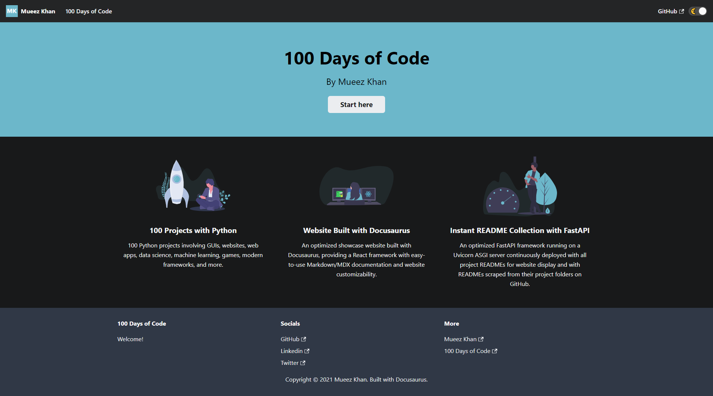

# 100 Days of Code

100 projects completed based on [Dr. Angela Yu’s Python bootcamp](https://www.udemy.com/course/100-days-of-code/), and an awesome showcase website built with [Docusaurus](https://docusaurus.io/) and [FastAPI](https://fastapi.tiangolo.com/).

## Welcome to 100 Days of Code!

Here you'll find many different projects I've built with **[Python](https://www.python.org/)** and other tools/frameworks.

### 100 Projects with Python

100 Python-focused projects involving GUIs, websites, web apps, data science, machine learning, games, modern frameworks, and more.

I've been building these projects from **[Dr. Angela Yu's 100 Days of Code Python Bootcamp](https://www.udemy.com/course/100-days-of-code/)**. It's really fun!

### Website Built with Docusaurus

An optimized showcase website built with Docusaurus, providing a React framework with easy-to-use Markdown/MDX documentation and website customizability.

This website is built with **[Docusaurus](https://docusaurus.io/)** and continuously deployed on **[Netlify](https://www.netlify.com/)** which is routed to a subdomain on **[Google Domains](https://domains.google.com/)**.

### Instant README Collection with FastAPI

An optimized FastAPI framework running on a Uvicorn ASGI server continuously deployed with all project READMEs for website display and with READMEs scraped from their project folders on GitHub. **[This Docusaurus plugin](https://github.com/rdilweb/docusaurus-plugin-remote-content)** then grabs the data for each of these days and adds it to the production build.

The pages are collected from my README files within the projects folder in my **[repository on GitHub](https://github.com/rzmk/100-days-of-code)** for each day, scraped with **[FastAPI](https://fastapi.tiangolo.com/)** that runs on a **[Uvicorn ASGI server](https://www.uvicorn.org/)** which is hosted on **[Heroku](https://www.heroku.com/)**.
